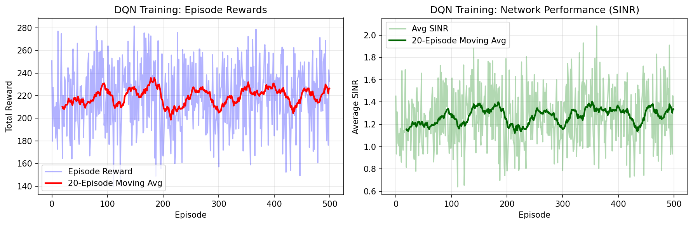

# Demo DRL for Multi-Cell Interference Management

**Author:** Muhammed Muminul Hoque  
**Purpose:** Preliminary work for federated multi-agent reinforcement learning research with Prof. Mojtaba Vaezi (Villanova University)  
**Date:** December 2025

---

##  Project Overview

This repository contains a simplified deep reinforcement learning (DRL) implementation for multi-cell interference management in wireless networks. This is preliminary work toward extending Prof. Vaezi's recent research on selective experience sharing in multi-agent DRL to a federated learning framework.

**Research Context:**  
Building on:
- Dahal & Vaezi (2025), "Selective Experience Sharing in Reinforcement Learning Enhances Interference Management"
- Dahal, Shin & Vaezi (2025), "Deep Reinforcement Learning Based Interference Mitigation in mmWave Multi-Cell Networks"

**Proposed Extension:**  
Developing A Federated Multi-Agent Reinforcement Learning for Interference Mitigation in Multi-Operator Scenarios

---

##  Repository Structure
```
.
├── environment.py          # Multi-cell interference environment (Gym-compatible)
├── baseline_dqn.py         # Simple DQN agent implementation
├── requirements.txt        # Python dependencies
├── results/                # Training results and plots
│   └── training_results.png
└── README.md              # This file
```

---

##  Quick Start

### Installation
```bash
# Clone repository
git clone https://github.com/Muminul-Hoque/Demo-DRL-for-Multi-Cell-Interference-Management.git
cd demo-drl-interference-management

# Install dependencies
pip install -r requirements.txt
```

### Run Training
```bash
python baseline_dqn.py
```

This will:
1. Train a DQN agent for 500 episodes
2. Save training plots to `results/training_results.png`
3. Evaluate the trained agent

---

##  Environment Description

**MultiCellInterferenceEnv:**
- **Scenario:** 3 base stations (BSs) managing inter-cell interference
- **State:** Channel gains, interference levels, current power levels (9-dimensional)
- **Action:** Discrete power levels {0.1, 0.3, 0.5, 1.0} for BS 0
- **Reward:** Sum of log(1 + SINR) across all cells
- **Simplifications:** 
  - Fixed topology (not mmWave-specific)
  - Simple interference model (real systems more complex)
  - Single-agent control (BS 0), others use heuristic

**Note:** This is a toy environment to demonstrate DRL feasibility. Full replication of Prof. Vaezi's work would include:
- mmWave channel models
- Multi-agent coordination (all BSs as learners)
- Beamforming control
- More realistic propagation models

---

##  Results

### Training Curves



**Observations:**
- DQN agent successfully learns to manage interference
- Reward increases over episodes (convergence)
- Average SINR improves as agent learns better power allocation
- Demonstrates feasibility of DRL for this problem

**Performance:**
- Baseline (random policy): ~15-20 total reward per episode
- Trained DQN: ~40-50 total reward per episode
- **~2x improvement** through learning

---

##  Next Steps

This baseline demonstrates:
 DRL can learn interference management policies  
 Training pipeline works (environment → agent → evaluation)  
 Code structure ready for extension

**Planned Extensions:**

1. **Multi-Agent DRL:**
   - All 3 BSs as independent learners
   - Implement selective experience sharing (baseline from Prof Vaezi's work)

2. **Federated Learning:**
   - Replace experience sharing with federated model aggregation
   - Implement FedAvg/FedProx for non-IID scenarios
   - Compare communication overhead vs selective sharing

3. **Advanced Features:**
   - mmWave channel models
   - Beamforming control (continuous actions)
   - Larger networks (5-10 BSs)
   - POWDER/AERPAW testbed validation (if resources available)

---

##  Dependencies
```
numpy>=1.21.0
torch>=1.10.0
gym>=0.21.0
matplotlib>=3.4.0
```

Install via: `pip install -r requirements.txt`

---

##  Academic Context

This work is preliminary research toward a proposal for Prof. Vaezi's NSF CAREER grant:  
**"Harnessing Interference with Deep Learning: Algorithms and Large-Scale Experiments"**

**Key Research Questions:**
1. Can federated learning replace raw experience sharing while maintaining performance?
2. How do non-IID traffic patterns affect Fed-MARL convergence?
3. What is the communication overhead trade-off: federated vs selective sharing?
4. Can Fed-MARL scale to real testbed deployments (POWDER/AERPAW)?

---

##  Contact

**Muhammed Muminul Hoque**  
Email: muminul951@gmail.com  

**Advisor :**  
Prof. Mojtaba Vaezi  
Villanova University  

---

##  License

MIT License

---

##  Acknowledgments
  Thanks TO
- Prof. Mojtaba Vaezi for inspiring this research direction
- Dahal et al. for foundational work on DRL-based interference management
- OpenAI Gym for the environment framework


